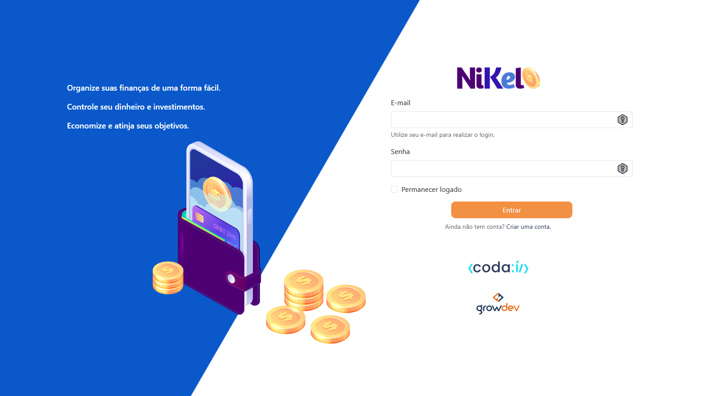
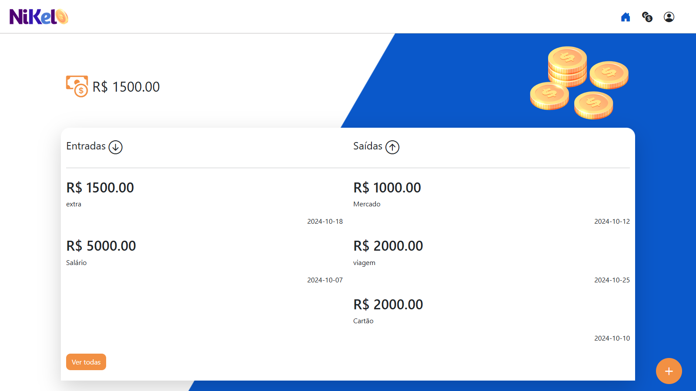
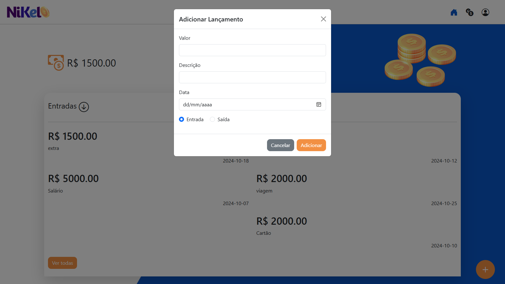
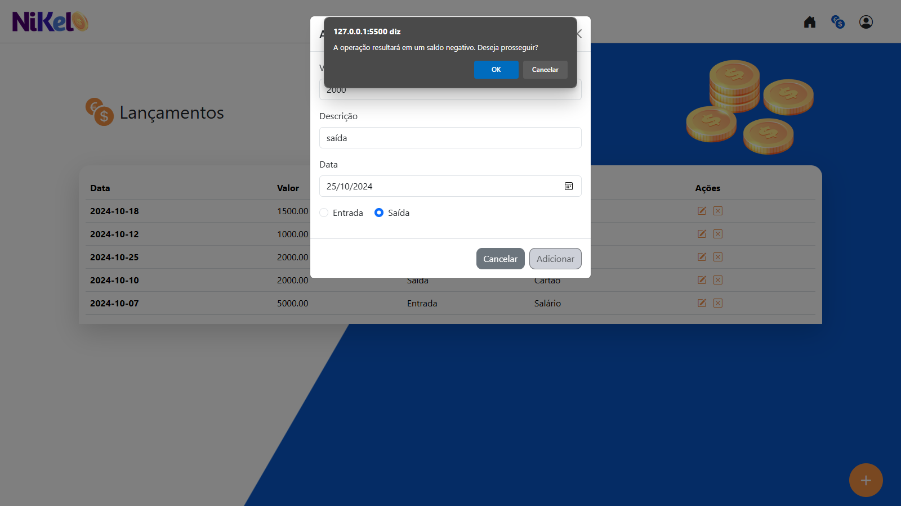
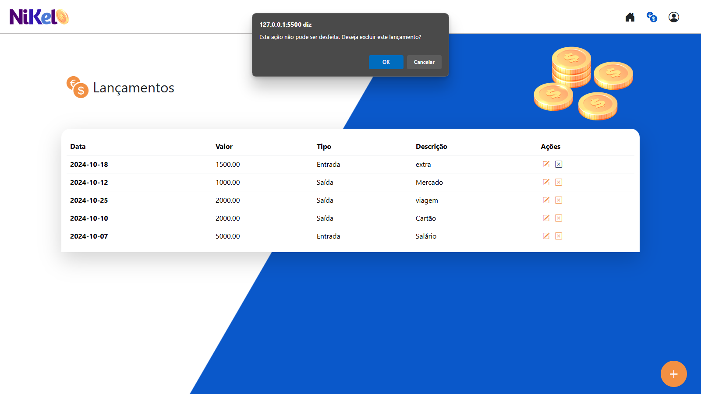

# Projeto Codaí 2.0

Este é um projeto da Growdev, utilizado como avaliação para inscrição no curso Fullstack Web Developer.

---

## Uso/Exemplos

Aplicação para controle financeiro com entradas e saídas.

---

## Funcionalidades

- Criação e login de usuário
- CRUD lançamentos (Adicionar, ver, editar e exluir)
- Validação de usuário
- Verificação de saldo negativo

---

## Screenshots

