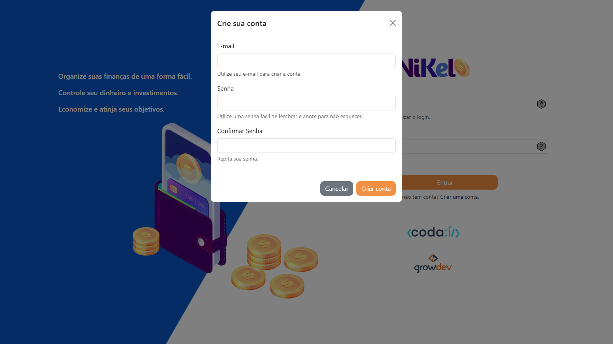
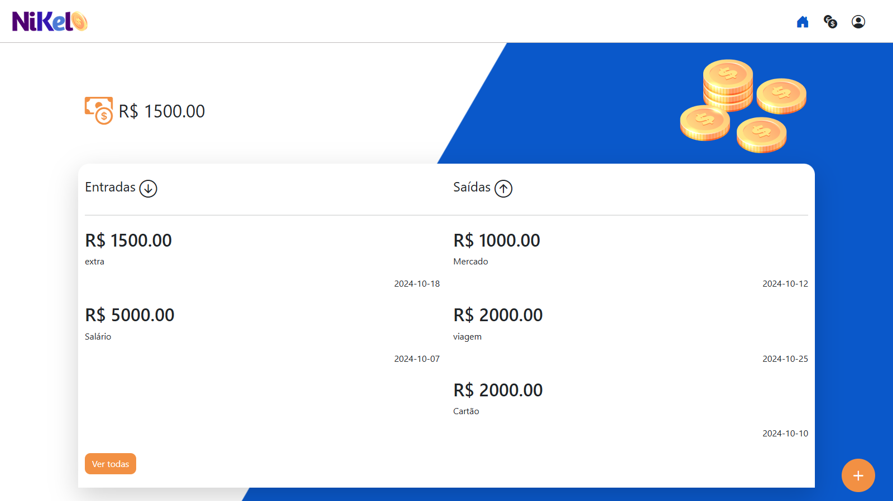
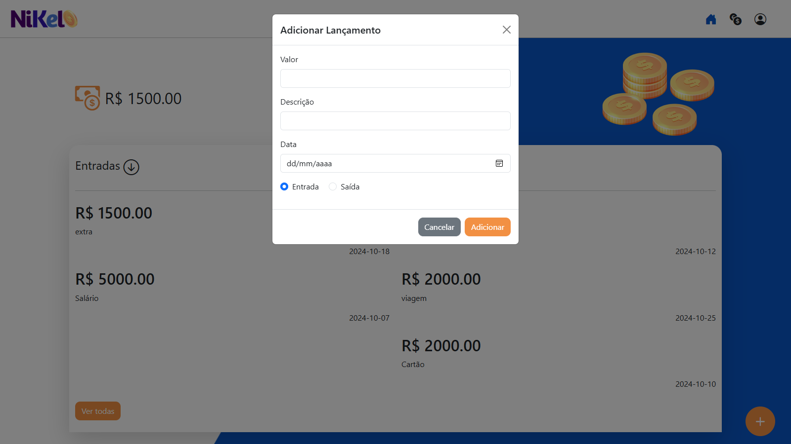
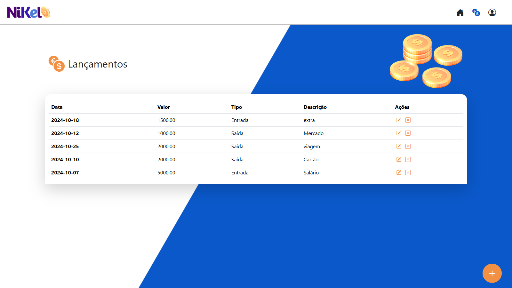
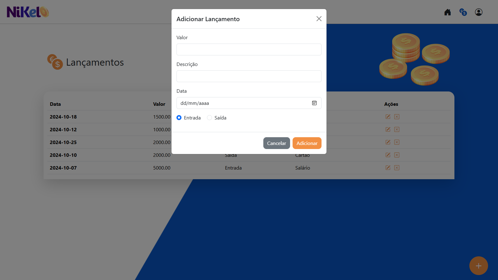
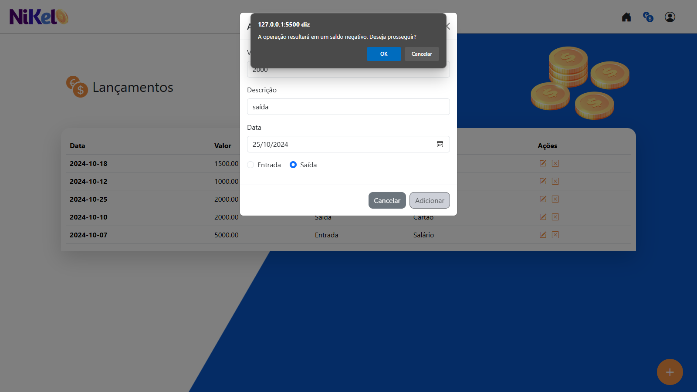
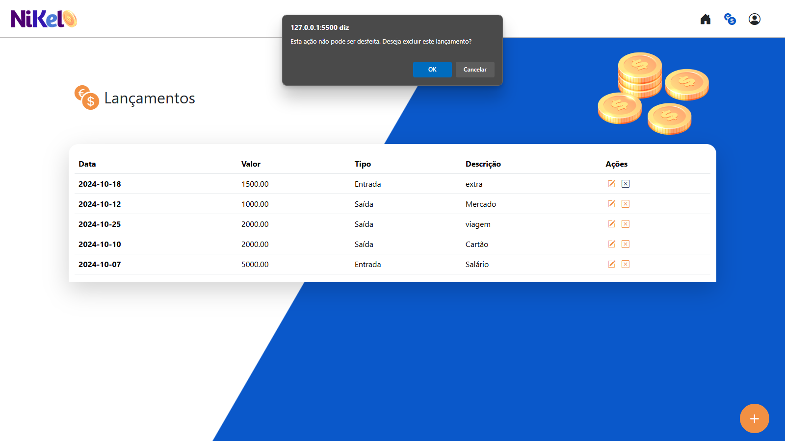

# Projeto Codaí 2.0

     

Este é um projeto da Growdev, 
  
utilizado como avaliação para inscrição no curso Fullstack Web Developer.  

## Uso/Exemplos

Aplicação para controle financeiro com entradas e saídas.

## Funcionalidades

- Criação e login de usuário
- CRUD lançamentos (Adicionar, ver, editar e exluir)
- Validação de usuário
- Verificação de saldo negativo

## Screenshots

    
    
    
    
    
    
    
    
    

